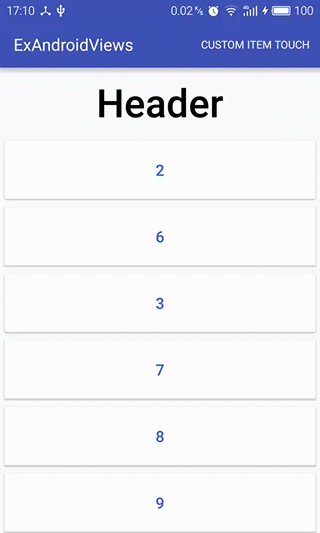

# ExRecyclerView
*使用 Kotlin 编写, 可以添加 Header 和 Footer, 监听 Load More , 支持 Drag 和 Swipe Item*



很多时候我们在使用 RecyclerView 时, 总是会碰到需要设置一个 header 或者 footer 的情况,
比如我们要加一个显示加载更多的footer，跟随 RecyclerView 一起滑动的 header, 等等,
这种情况如果是 ListView 我们可以简单的使用 `addHeaderView()` 或者 `addFooterView()`
就可以解决, 但是 RecyclerView 就需要我们自己来进行处理. 虽然说不困难,
但是每次都要重新实现一遍就很麻烦了.

ExRecyclerView一共实现了3个功能:

1. 能添加和删除 header 和 footer
2. 滑到底部时回调加载更多
3. 支持 Drag 和 Swipe 拖动 item 或者 swipe 删除 item (可以自定义拖动,滑动的样式)

ExRecyclerAdapter 是一个内置了 List 集合的 RecyclerAdapter,
每次改变数据都会主动进行相应的notify(也可以主动不进行 notify) , 另外 ExRecyclerAdapter 也实现了一个简单的
ItemActionListener!

## ExRecyclerView

### Usage

```xml
<cn.kejin.android.views.ExRecyclerView
    android:id="@+id/exRecycler"
    android:layout_margin="50dp"
    android:layout_width="match_parent"
    android:layout_height="match_parent"
    app:header="@layout/layout_header"
    app:footer="@layout/layout_footer"/>
```

```java
exRecycler.layoutManager = LinearLayoutManager(this)
exRecycler.adapter = Adapter(this)
exRecycler.addHeader(header)
exRecycler.addFooter(footer)

exRecycler.setOnLoadMoreListener {
    // do load more, 结束之后调用 exRecycler.endLoadMore() 结束loading more的状态
}

exRecycler.itemActionListener = listener
// 如果使用自定义 ItemTouchHelper
exRecycler.itemTouchHelper = customItemTouchHelper
```

### Header & footer

| 方法/属性 | 说明 |
| ----------  | ---- |
| `app:header` | 在 xml 布局中定义 header view |
| `app:footer` | 在 xml 布局中定义 footer view |
| `getHeader()` | 获取定义在 xml 中的 header view |
| `getFooter()` | 获取定义在 xml 中的 footer view |
| `removeHeader()`  | 移除定义在 xml 中的 header |
| `removeFooter()` | 移除定义在 xml 中的 footer |
| | |
| `getHeaderSize()` | header size |
| `hasHeader(view)` | 判断是否有此header |
| `addHeader(view)` | 加入一个 header, 并返回它的 hashcode, 可以根据这个 hashcode 找到或者删除这个header |
| `getHeader(hashcode)` | 根据 view 的 hashcode 找到这个header |
| `removeHeader(view)` `removeHeader(hashcode)` | 根据 view 或者他的 hashcode 移除掉这个 header |
| | |
| `getFooterSize()` | footer size |
| `hasFooter(view)` | 判断是否由此footer |
| `addFooter(view)` | 加入一个 footer, 并返回它的 hashcode, 这个根据这个 hashcode 获取或者删除这个footer |
| `getFooter(hashcode)`  | 根据 view 的 hashcode 找到这个footer |
| `removeFooter(view)` `removeFooter(hashcode)` | 根据 view 或者他的 hashcode 移除掉这个 footer |
| | |
| `getItemCount()` | 获取所有的 Item 个数 |

这些 header 和 footer 都是不会被 RecyclerView 进行回收的, 所以注意避免加入过多的 header 或者 footer.


### OnLoadMoreListener

当 ExRecyclerView 滑动到底部(倒数第二个可见) 时，就会回调表示可以进行 load more 操作.
但是要注意的是当 回调了 load more 之后, ExRecyclerView 会把状态置为 loadingMore 状态,
即不允许在正在执行 load more 操作时再回调 load more 事件, 当 load more 结束之后,
就必须要调用 `exRecycler.endLoadMore()` 来结束 loadingMore 状态.

```kotlin
interface OnLoadMoreListener {
    /**
     * @return Boolean 是否处理了loadmore操作,
     * 如果返回true, 表示进行了 loadmore 操作, 则在没有调用 endLoadMore() 之前不会再回调 loadmore
     * 如果返回false, 表示没有进行 loadmore 操作, 则继续监听滑动
     */
    fun onLoadMore(): Boolean
}
```

| 属性/方法 | 说明 |
| --------------- |
| `isLoadingMore` | 判断是否正在loading more 的状态, 如果为true, 则表示正在加载更多, ExRecyclerView 不会再回调loadmore 操作 |
| `loadMoreListener` `setOnLoadMoreListener` | 设置监听 |
| `endLoadMore()` | 将isLoadingMore 的状态置为 false, 让 ExRecyclerView 继续监听到底回调 loadmore 操作

### Drag & Swipe

Drag Move 和 Swipe Dismiss 的实现, 我参考了 [Drag and Swipe with RecyclerView](https://medium.com/@ipaulpro/drag-and-swipe-with-recyclerview-b9456d2b1aaf#.2g0vy5xp0)
但是我觉得他写的有点复杂了, 可能是他写的类和接口太多了吧 -\_-!!

Drag & Swipe 的实现是用了 [ItemTouchHelper](https://developer.android.com/reference/android/support/v7/widget/helper/ItemTouchHelper.html) 这个帮助类,
ExRecyclerView 内部已经实例化了一个 ItemTouchHelper, 并已经进行了 Attach,
如果你想完全用自己的 ItemTouchHelper, 只要将你的 ItemTouchHelper attach ExRecyclerView 就可以,
不过要注意不能移动 header 或者 footer, 还有将ExRecyclerView 的内部变量 itemTouchCallback = null, itemActionListener = null;

| 属性/方法 | 说明 |
| --------------- |
| `itemTouchHelper` | ExRecyclerView 的内置 ItemTouchHelper |
| `itemTouchCallback` | 自定义的ItemTouchHelper.Callback |
| `itemActionListener` | ItemActionListener的实现 |


#### ItemActionListener

ItemActionListener 其实只是把 ItemTouchHelper.Callback 的主要的方法抽离了出来, 方便实现,
ExRecyclerAdapter 实现了一个简单的 ItemActionListener, 并可以控制 Drag 或者 Swipe 是否可用

